# 💰 Awesome Accounts Receivable Automation 🚀

    

> ⚡ **A curated list of Enterprise SaaS Platforms, Open-Source Software, and AI Tools for Accounts Receivable (AR) Automation, Invoice-to-Cash (I2C), Automated Dunning, Cash Application, and AR Analytics.**

---

## 📑 Table of Contents
- [📈 Industry Overview & Market Insights](#-industry-overview--market-insights)
- [🏢 SaaS & Commercial Platforms](#-saas--commercial-platforms)
- [💻 Open-Source GitHub Projects](#-open-source-github-projects)
- [🤝 How to Contribute](#-how-to-contribute)
- [💖 Support & Sponsorship](#-support--sponsorship)
- [📈 Star History](#-star-history)
- [⚠️ Disclaimer](#%EF%B8%8F-disclaimer)

---

## 📈 Industry Overview & Market Insights

> 💡 **Market Size & Fragmentation:**  
> The global **Accounts Receivable Automation Market** size was valued at approximately **$2.5 Billion to $3.2 Billion in 2025** and is projected to expand at a Compound Annual Growth Rate (CAGR) of **12.5% to 14.2%**, reaching over **$7.5 Billion by 2032**.  
> The sector is **moderately fragmented**: enterprise cash application and complex multi-ERP order-to-cash workflows are led by major consolidated players (such as HighRadius, BlackLine, and Billtrust), while the mid-market and SMB automated dunning and customer portal segments remain active with fast-growing specialized SaaS vendors and emerging open-source stacks.

---

## 🏢 SaaS & Commercial Platforms

Below is a comparative breakdown of top commercial Accounts Receivable (AR) platforms, sorted by corporate valuation / revenue (descending).

| 🏢 Platform | 💰 Valuation / Scale (Descending) | 🏷️ Starting Price | 🆓 Free Plan / Trial Limit | 🔑 Key Capabilities |
| :--- | :--- | :--- | :--- | :--- |
| **[HighRadius](https://www.highradius.com/)** | **$3.10 Billion (Valuation)** / ~$500M+ ARR | ~$50,000 / year (or Outcome-Based gain share) | ❌ **None** (Complimentary process assessment & guided demo) | Autonomous O2C, AI credit scoring, predictive cash application & collections. |
| **[BlackLine](https://www.blackline.com/)** | **$1.73 Billion (Market Cap)** / ~$730M Annual Revenue | ~$13,000 / year (modular enterprise licensing) | ❌ **None** (Personalized product demo only) | Financial close, automated transaction matching, order-to-cash & cash application. |
| **[Billtrust](https://www.billtrust.com/)** | **$1.50 Billion (Acquisition Valuation)** / ~$96.4M Revenue | ~$20,000 / year (custom volume pricing) | ❌ **None** (Guided ERP integration demo only) | Electronic invoice presentment, automated payment matching & B2B portal. |
| **[Quadient AR](https://www.quadient.com/)** *(formerly YayPay)* | **$480 Million (Parent Market Cap)** / ~$1.18B Parent Revenue | ~$10,000 / year (custom quote by invoice volume) | ❌ **None** (Zero-commitment custom demo available) | B2B payment portals, automated dunning, credit risk scoring & ERP integrations. |
| **[Versapay](https://www.versapay.com/)** | **$100 Million+ (Valuation)** / ~$42M Revenue | ~$15,000 / year (custom quote by transaction volume) | ❌ **None** (Personalized consultation & demo) | Collaborative AR, buyer-supplier payments network & cash application. |
| **[Chaser](https://www.chaserhq.com/)** | **$15 Million (Est. Valuation)** / ~$5M Revenue | **$259 / month** (Compact plan, billed annually) | ⏱️ **10-Day Free Trial** (No credit card required) | Automated email/SMS payment reminders, credit checking & outsourced collections. |
| **[Invoiced](https://www.invoiced.com/)** | **$10 Million (Est. Valuation)** / ~$4M Revenue | ~$500 / month (custom SMB / mid-market quote) | ⏱️ **14-Day Free Trial** (Or personalized product demo) | Subscription billing, customer self-service payment portal & automated dunning sequences. |
| **[Kolleno](https://www.kolleno.com/)** | **$8 Million (Est. Valuation)** / ~$2M Revenue | ~$350 / month (custom mid-market tier) | ⏱️ **14-Day Free Trial** (Available upon request) | AI-first receivables management, omnichannel communications & reconciliation. |
| **[Upflow](https://upflow.io/)** | **$6 Million (Est. Valuation)** / ~$2M Revenue | ~$400 / month (custom quote based on AR volume) | ⏱️ **14-Day Free Trial** (Or live interactive demo) | Financial Relationship Management (FRM), executive cash dashboards & dunning. |
| **[Growfin](https://www.growfin.ai/)** | **$5 Million (Est. Valuation)** / ~$1.5M Revenue | ~$300 / month (custom SaaS AR tier) | ⏱️ **14-Day Free Trial** (Available for qualified finance teams) | Real-time AR collaboration, cash flow forecasting & multi-currency billing integration. |

---

## 💻 Open-Source GitHub Projects

Explore top self-hosted and open-source software solutions for invoicing, receivables tracking, payment collection, and ERP integration. Repositories are sorted by GitHub Star Count (descending).

| 📦 Repository & Description | ⭐ Star Count Badge | 🛠️ Tech Stack & Highlights |
| :--- | :--- | :--- |
| **[Odoo](https://github.com/odoo/odoo)**    Full-featured open-source ERP suite featuring robust invoicing, payment gateways, dunning reminders, and receivables management. |  | Python, JavaScript, PostgreSQL • Full ERP & Receivables |
| **[ERPNext](https://github.com/frappe/erpnext)**    Enterprise open-source ERP system with native invoicing, customer portals, accounts receivable ledgers, and automated payment requests. |  | Python, Frappe Framework, MariaDB • Enterprise Accounting |
| **[Invoice Ninja](https://github.com/invoiceninja/invoiceninja)**    Leading open-source invoice and billing application for freelancers and businesses with online payments, client portal, and quotes. |  | PHP (Laravel), Flutter • Self-Hosted Invoicing & Billing |
| **[Crater](https://github.com/crater-invoice/crater)**    Open-source web & mobile invoicing application built to track expenses, estimate costs, and collect payments easily. |  | PHP (Laravel), Vue.js, React Native • Mobile & Web AR |
| **[Kill Bill](https://github.com/killbill/killbill)**    Open-source subscription billing and payment platform enabling complex recurring revenue and invoice generation. |  | Java • Open SaaS & Recurring Receivables |
| **[InvoiceShelf](https://github.com/InvoiceShelf/InvoiceShelf)**    Self-hosted open-source invoicing platform for generating invoices, tracking payments, managing recurring billing, and client communication. |  | PHP (Laravel), Vue.js • Invoicing & Customer Portals |
| **[OpenAR / Accounts Receivable Initiative](https://github.com/worlds-biggest-software-project/063-accounts-receivable-collections)**    AI-native open-source concept repository focused on mid-market dunning, cash application matching, and aging analytics. |  | Python, TypeScript • AI-Native Collections & Cash App |

---

## 🤝 How to Contribute

Contributions are welcome! Please follow these simple steps:

1. 🍴 **Fork the repository**
2. 📝 **Add or update entries** in `README.md` (keep formatting consistent with existing tables)
3. 📌 **Include essential details**: Name, website/repo link, clear description, pricing/stars, and categories.
4. 📬 **Submit a Pull Request** with a brief summary of additions.

---

## 💖 Support & Sponsorship

Thank you for exploring and using this repository! If you find this list helpful for your finance workflows or open-source projects, please consider supporting the project:

- ⭐ **Star this repository** on GitHub to show your appreciation and help others discover it.
- 🔀 **Fork & Share** it with your colleagues, finance automation teams, and developer community.
- ☕ **Buy me a coffee / Sponsor**: You can sponsor ongoing maintenance and open-source updates via the [GitHub Sponsor Dashboard](https://github.com/sponsors/ishandutta2007).

---

## 📈 Star History

---

## ⚠️ Disclaimer

- This list is **community-curated** for informational and educational purposes only.
- Accounts Receivable tools process sensitive financial data. Ensure proper security compliance, payment application accuracy, and data protection before deploying in production environments.
- Open-source solutions provide full data ownership but require self-hosting infrastructure and routine maintenance. Commercial solutions transfer operational burdens to SaaS vendors.

---

**Made with ❤️ for CFOs, Controllers, FinOps Teams, and AR Automation Engineers.**
